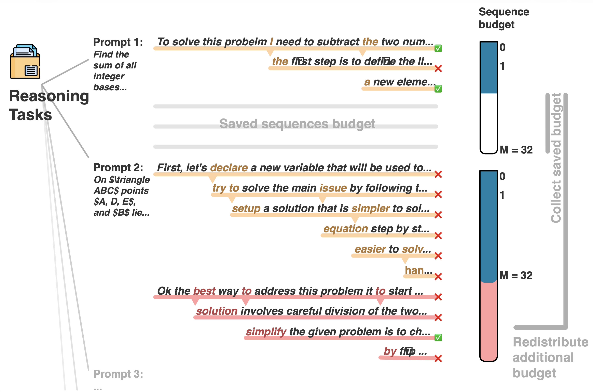
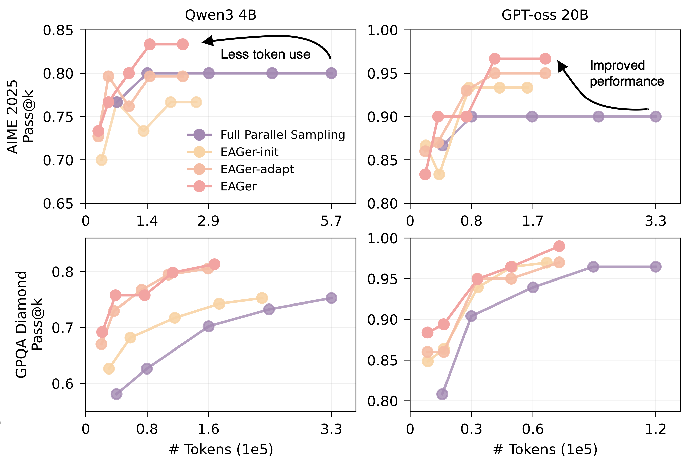

# EAGer: **E**ntropy-**A**ware **GE**ne**R**ation for Adaptive Inference-Time Scaling

<div align="center">

[📜 **Read the paper here** (coming soon) 📜](https://arxiv.org/abs/2510.11170) · [🗣️ I want to cite you 🗣️](#citation)

[Daniel Scalena](https://www.danielsc4.it/)<sup>1,2</sup> · [Leonidas Zotos](https://www.rug.nl/staff/l.zotos/?lang=en)<sup>1</sup> · [Elisabetta Fersini](https://en.unimib.it/elisabetta-fersini)<sup>2</sup> · [Malvina Nissim](https://malvinanissim.github.io/)<sup>1</sup> · [Ahmet Üstün](https://ahmetustun.github.io)<sup>3</sup>

<sup>1</sup>University of Groningen · <sup>2</sup>University of Milano-Bicocca · <sup>3</sup>Cohere

<br/>




</div>

---

## 🌍 Overview

**EAGer** is a training-free method that dynamically adjusts compute at inference time based on token-level uncertainty. Instead of allocating the same compute budget for every prompt, EAGer branches into multiple reasoning paths only when the model encounters high-entropy tokens—indicating uncertainty.

**🔑 Key Benefits:**
- ✨ Reduces redundant computation by up to 65%
- 🎯 Improves reasoning performance by up to 37% in Pass@k
- ⚡ Enables adaptive scaling without additional training
- 🔄 Automatically reallocates saved compute to more complex instances

---

## ⚙️ Quick Start

### 1. Installation

Install dependencies using [UV](https://docs.astral.sh/uv/) (recommended):

```bash
uv pip install -e .
```

Or using pip:

```bash
pip install -e .
```

### 2. Running Experiments

Execute experiments using the `src.main_vllm` script:

```bash
python -m src.main_vllm \
    --model_name "openai/gpt-oss-20b" \
    --data_name "opencompass/AIME2025" \
    --temperature 0.6 \
    --entropy_threshold 2.2 \
    --max_sequences 32 \
    --experiments "eager" \
    --output_dir "$output_dir" \
    --seed 55
```

➡️ `example_execution.sh` provides a simple example to run experiments following the same format as above.

---

## ⚙️ Configuration

### Core Parameters

| Parameter | Description | Example |
|-----------|-------------|---------|
| `model_name` | HuggingFace model identifier | `openai/gpt-oss-20b` |
| `data_name` | HuggingFace dataset identifier | `opencompass/AIME2025` |
| `temperature` | Sampling temperature (must be > 0) | `0.6` |
| `entropy_threshold` | Branching threshold (~2.0 for EAGer-init, ~2.4 for EAGer) | `2.2` |
| `max_sequences` | Maximum parallel sequences | `32` |
| `experiments` | Experiment type to run | `eager` |
| `output_dir` | Output directory (serves as experiment ID) | See below |
| `seed` | Random seed for reproducibility | `55` |

### Supported Models

- `HuggingFaceTB/SmolLM3-3B`
- `Qwen/Qwen3-4B`
- `deepseek-ai/DeepSeek-R1-0528-Qwen3-8B`
- `openai/gpt-oss-20b`

💡: *Any model supported by vLLM should work.*

### Supported Datasets

- `Maxwell-Jia/AIME_2024` (math)
- `opencompass/AIME2025` (math)
- `MathArena/hmmt_feb_2025` (math)
- `fingertap/GPQA-Diamond` (science)
- `evalplus/humanevalplus` (code generation)

### Experiment Types

| Type | Description | Prerequisites |
|------|-------------|---------------|
| `parallel` | Standard parallel sampling baseline | None |
| `eager_init` | Initial EAGer with fixed threshold | None |
| `eager_adapt` | Adaptive threshold adjustment | Requires `eager_init` |
| `eager` | Full EAGer with dynamic compute allocation | Requires `eager_init` |
| `all` | Run all experiments sequentially | None |

### Output Directory Structure

Experiments are saved to: `outputs/{model_name}/{data_name}/{timestamp}/`

**Example:** For `Qwen/Qwen3-4B` on `opencompass/AIME2025`, outputs are placed in:  
`outputs/Qwen3-4B/AIME2025/2025-10-01_12-00-01/`

**Auto-create directory:**

```bash
model_name="Qwen/Qwen3-4B"
data_name="opencompass/AIME2025"
timestamp=$(date +%F_%H-%M-%S)

model_dir_name=$(basename "$model_name")
data_dir_name=$(basename "$data_name")
output_dir="outputs/${model_dir_name}/${data_dir_name}/${timestamp}"
mkdir -p "$output_dir"
```

Then pass it to the script using `--output_dir "$output_dir"`.

**Output JSON structure**

Every experiment produces a JSON file stored in the specified `output_dir`.
This file logs all metadata, configurations, and results of the experiment.


<details>
    <summary>📀 <ins>Click to reveal the general structure of the JSON output</ins></summary>
    
    ```json
    {
        // Experiment metadata and parameters
        "model_name": "Qwen/Qwen3-4B",
        "temperature": 0.6,
        "entropy_threshold": 2.5,
        "max_sequences": 32,
        "seed": 55,
        
        // Checkpoint state (to allow resuming if interrupted)
        "status": {
            "state": "COMPLETED",
            "completed_sequences": 30,
            "total_sequences": 30,
            "progress": "30/30"
        },
        
        // Extra information
        "extra": {
            "notes": "",
            "generation_time_so_far (s)": 33938.9826028347
        },
        
        // Automatically computed metrics
        "results": {
            "avg_acc": 0.89,
            "pass_at_1": 0.95,
            "cons_at_max": 0.68
        },

        // Entropy-aware generation details for each prompt, "default-generations" for Full Parallel sampling
        "entropy-aware-generations": [
            {
                // original prompt
                "prompt": "Find the sum of all integer bases $b>9$ for which $17_{b}$ is a divisor of $97_{b}$.",
                // number of actual sequences -> max at M (Full Parallel or EAGer-init) or M + b (EAGer-adapt or EAGer)
                "generated_sequences": 1,
                "target": "70",
                // extracted answer from \boxed{} env.
                "extracted_answers": "['70', '70']",
                // List of all generated reasoning paths
                "generations": [
                    "<|im_start|>user\nFind the sum of all integer bases $b>9$ [...] \n### Final Answer\n\n$$\n\\boxed{70}\n$$",
                    "<|im_start|>user\nFind the sum of all integer bases $b>9$ [...] \nFinal answer is: $$\n\\boxed{70}\n$$"
                ],
                // Token-level entropy values for each sequence
                "entropies": [
                    "[0.0002, 0.0, 0.0362, 0.1260 [...], -2.0]",
                    "[-1, -1, -1, 0.1260 [...], -2.0]"      // this is a branched sequence, -1 = token reused from parent sequence
                ],
                // Records of all branching events (if any)
                "recorded_branches": [
                        "{'seq_idx': 0, 'gen_step': 315, 'auto_selected_token': ' sym', 'entropy': 2.557540054321289, 'entropy_threshold': 2.5, 'man_token_original': ' sym', 'man_token_branch': ' favorable', 'new_seq_idx': 1, 'last_generated_chars': ' number of total possibilities, by considering'}",
                ]
            }
            // ... additional prompts
        ]
    }
    ```
</details>

Each JSON file is optimized for **human readability** and easy access.

A corresponding `.large` summary file can be generated using:
```bash
python script_manual_parallel_recapper.py <model_name> <data_name> <timestamp>
```
(see the 🧩 **Evaluation** section below for details).

### Advanced Parameters

```bash
--dtype "bfloat16"                    # Model precision
--max_model_len 32768                 # Maximum context length
--gpu_memory_utilization 0.8          # GPU memory usage (0.0-1.0)
--device "cuda"                       # Device to use
```

---

## 🧩 Evaluation

### Automatic Evaluation

Evaluation for `Maxwell-Jia/AIME_2024`, `opencompass/AIME2025`, and `fingertap/GPQA-Diamond` runs automatically during experiments. Answers are extracted from `\boxed{}` environments to compute Pass@k, Cons@k, and PassRate metrics.

### Code Generation Evaluation

For `evalplus/humanevalplus`, use the provided evaluation script:

⚠️ **Warning:** This script executes generated code locally without sandboxing, which poses security risks.

```bash
python script_eval_code_gen.py Qwen3-4B AIME2025 2025-10-01_12-00-01
```

For advanced evaluation, refer to the [evalplus documentation](https://github.com/evalplus/evalplus/blob/master/docs/cli.md).

### Summary of Results

To recap results from any experiment folder:

```bash
python script_manual_parallel_recapper.py Qwen3-4B AIME2025 2025-10-01_12-00-01
```

---

## Citation

```bibtex
@misc{scalena2025eagerentropyawaregenerationadaptive,
      title={EAGER: Entropy-Aware GEneRation for Adaptive Inference-Time Scaling}, 
      author={Daniel Scalena and Leonidas Zotos and Elisabetta Fersini and Malvina Nissim and Ahmet Üstün},
      year={2025},
      eprint={2510.11170},
      archivePrefix={arXiv},
      primaryClass={cs.LG},
      url={https://arxiv.org/abs/2510.11170}, 
}
```

---
---

## 🧾 Abstract

With the rise of reasoning language models and test-time scaling methods as a paradigm for improving model performance, substantial computation is often required to generate multiple candidate sequences from the same prompt. This enables exploration of different reasoning paths toward the correct solution, however, allocates the same compute budget for each prompt. 

Grounded on the assumption that different prompts carry different degrees of complexity, and thus different computation needs, we propose **EAGer**, a training-free generation method that leverages model uncertainty through token-wise entropy distribution to reduce redundant computation and concurrently improve overall performance.

EAGer allows branching to multiple reasoning paths only in the presence of high-entropy tokens, and then reallocates the saved compute budget to the instances where exploration of alternative paths is most needed.

We find that across multiple open-source models on complex reasoning benchmarks such as AIME 2025, EAGer can reallocate the budget without accessing target labels, achieving the best efficiency–performance trade-off in terms of both token usage and Pass@k. When target labels are accessible, EAGer generates up to 65% fewer tokens (hence saving compute) and achieves up to 37% improvement in Pass@k compared to the Full Parallel sampling.

Our results show that EAGer consistently maximizes the efficiency-performance trade-off by enabling dynamic control over computation expenditure.
